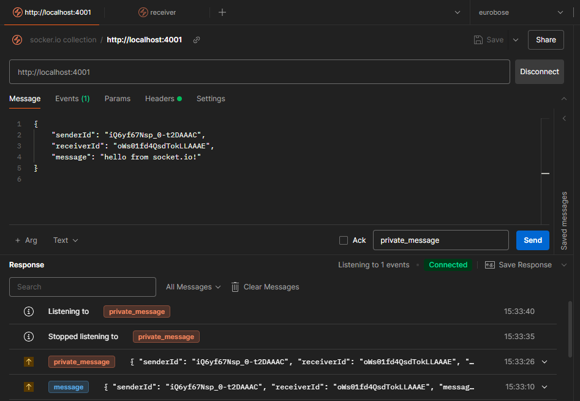

# Testing Socket.io with Postman

To test Socket.io endpoints using Postman, follow these steps:

## Setup

1. **Open Postman** and enter your Socket.io URL in the "Enter URL" field. This should be your local server address, e.g., `http://localhost:{process.env.PORT}`.

2. **Add Event Listener**:
   - In the "Event Listener Name" field at the bottom right, specify the name of the event you want to listen for. Ensure this event name matches the one used in your Socket.io server.

3. **Press Connect** to establish a connection to the Socket.io server.

## Sending a Message

1. **Set the Method to socket.io** and switch to the **message** tab in Postman.

<!-- 2. **Choose `raw`** and set the type to `JSON`. -->

3. **Enter the JSON payload** in the body as shown below:

    ```json
    {
        "senderId": "euTGLnlO4vtvMcZKAAAB",
        "receiverId": "hcNZr04mdr-AybN_AAAD",
        "message": "hello from socket.io!"
    }
    ```

4. **Send the Request** by clicking the "Send" button.

## Receiving Messages

- Once the message is sent, you should be able to receive messages in the format you have set up on your Socket.io server.

- For reference, you can view captured messages in your application or in the Socket.io logs.



## Notes

- Ensure that your server is running and correctly configured to handle Socket.io connections.
- The event listener name must match exactly with the server-side event handler.
- Socket.io may need additional configuration on the server-side for full functionality.

For further details, refer to the Socket.io [documentation](https://socket.io/docs/v4/).
